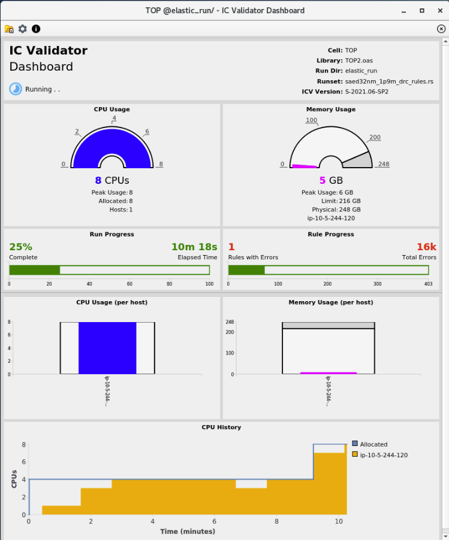
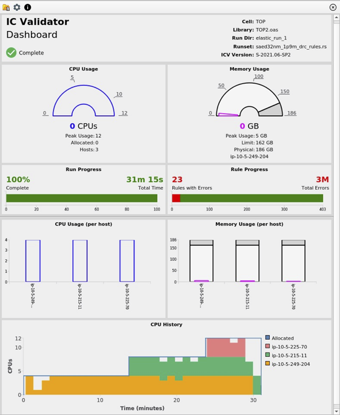

# Lab 3: Run ELASTI Test Case

Synopsys IC Validator (ICV) has the ability to request CPUs when it needs additional resources and can also relinquish CPUs when it no longer needs them. In this lab, we'll use ICV `-host_elastic` option to provide a script that ICV can use to dynamically add CPUs when it is running on AWS.

## Step 1: Run the ELASTI test case
 
1. Change directory to ELASTI `cd ELASTI` and hit enter.

1. Run the test case by typing `./runme` then hit enter.

1. You should see a message indicating that a job has been submitted to the cluster scheduler (OpenPBS in this case) with the corresponding job id. 

## Step 2: Watch job status

1. Run the `qstat` command to view the status of the jobs. 

1. You can also view job status by clicking on **My Job Queue** in the left side navigation bar in SOCA portal under **PROFILE** section as shown in the screen shot below:

    

    The result should be similar to the screen shot below which is a table format showing job id, name, status, etc...:

    

1. You can run the `pbsnodes -aSjL` command to see the EC2 instances that have joined the cluster. Initially, the nodes will be in **state-unknown,down** till they boot-up and join the queue.

    !!! note
        SOCA automation scripts are configured to monitor the status of the queues every minute. It typically takes 5-6 minutes to launch a new EC2 instance, boot the operating system, configure it to join the cluster, and have the assigned job to start running.

## Step 3: Monitor ELASTI job 

1. Monitor the status of ELASTI job by refreshing the **My Job Queue** page in SOCA portal and look for the **Status** column for the job with `ELASTI` under **Name** column.

1. You can also monitor the status of the jobs in the terminal by typing `` watch -n 10 "qstat -u `whoami`" `` command which will keep monitoring the status of the jobs every 10 seconds. You'll need to wait for the **S** column represeting the status of the job correspoding to the one with **ELASTI** under **Name** column. 

1. Once the job is in the running state (**S** column changes to **R** in the terminal or **Status** column changes to **RUNNING** on **My Job Queue** page in SOCA portal), hit **CTRL+C** in the terminal to exit of the watch command.

1. Then look inside elastic_run/run_details directory for a file that matches *.dp.log by typing `ls elastic_run/run_details/*.dp.log`. Wait until this log file is created before moving to the next step.
 
## Step 4: Run ICV Dashboard to monitor progress of the ELASTI test case

1. Monitor the progress of the ELASTI test case by typing this command: `icv_dashboard -keys hSdSVaCfhpv elastic_run/run_details/saed32nm_1p9m_drc_rules.dp.log &`

1. As the job progresses, ICV will request more CPU resources or release idle resources. In this example, it will submit a new job to the cluster so it can obtain additional resources dynamically. You an monitor the status of the jobs by typing `` watch -n 10 "qstat -u `whoami`" `` command in the terminal to keep monitoring the status of jobs every 10 seconds.

1. Depending on resource availability in the cluster, SOCA might need to create additional instances for the new job. Once the resources become available and the job status changes to running, the CPU history section in the ICV dashboard would be updated to reflect the additioanl CPUs as shown below.

    

1. ICV will repeat this process one more time and the final ICV dashboard should be similar to the screenshot below. 

    !!! note
        You don't have to wait till the completion of this test case and can move to the next lab.
 
    

In this lab you learned how to submit ICV ELASTI test case jobs to the cluster, how to monitor the status of these jobs, and how to visualize the job progress using ICV dashboard.

Click **Next** to move to the next lab.
