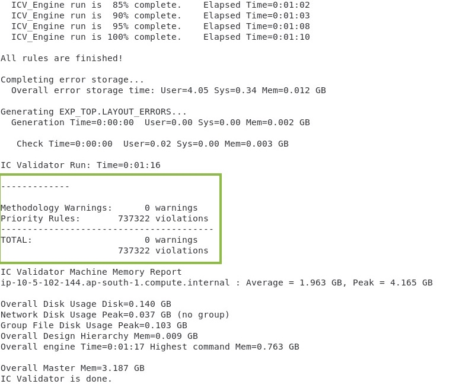
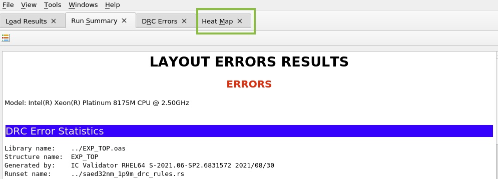
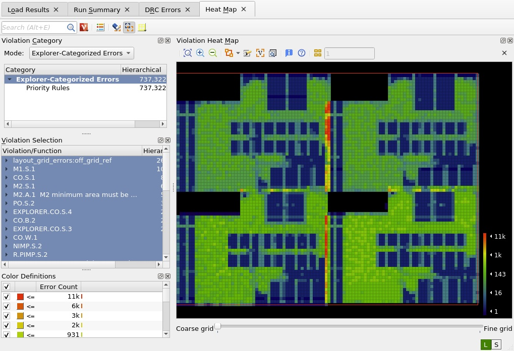
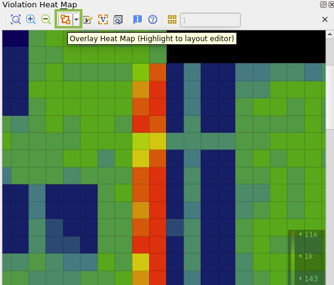
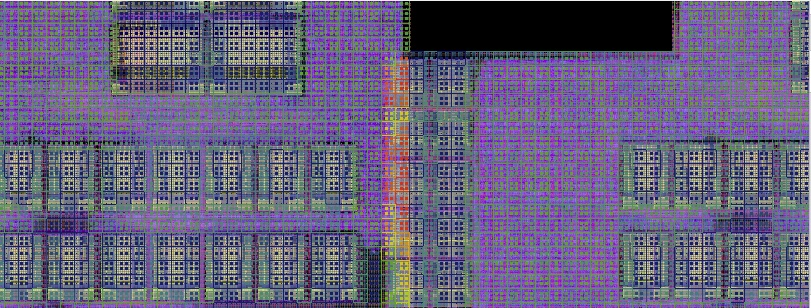
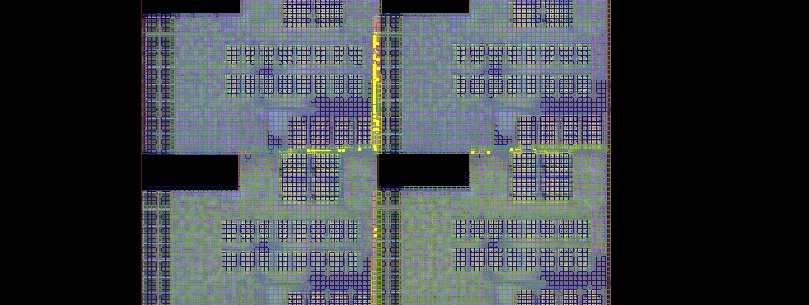
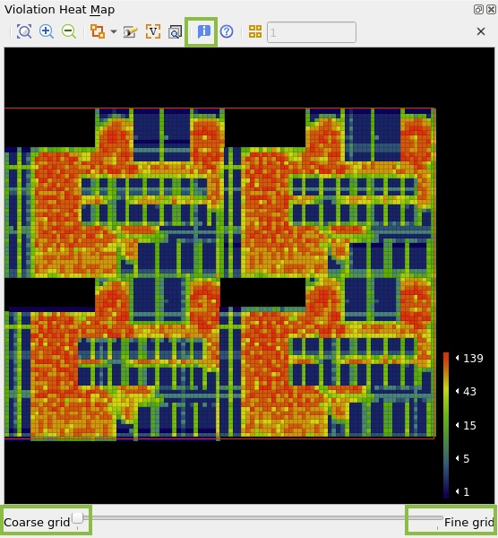
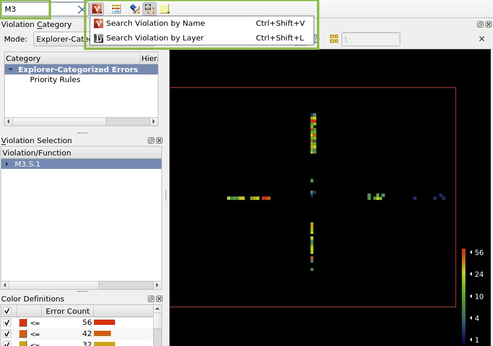

# Lab 4: Run EXPLORER Test Case

Explorer analysis gives users options to quickly check on multiple design weaknesses.

ICV DRC Explorer runs on dynamically selected parts of signoff runset. This mode comes very handy while running designs that are still in maturing state. 

In the lab you will see DRCs caused from instance overlap, DRCs caused from re-use of old blocks that have diffrent width and spacing requirements.

IC Validator offers Explorer functions both on DRC and LVS. This lab only talks about DRC Explorer.

## Step 1: Run the EXPLORER test case
 
1. Change directory to EXPLORER test case by typing `cd ../EXPLORER` and hit enter.

1. Run the test case by typing `./runme` then hit enter.

1. ICV should run directly on the remote desktop host (i.e, doesn't submit a job to the scheduler) and should generate a log similar to this

    

## Step 2: Launch ICV Workbench

1. Launch ICV Workbench for quick and easy viewing of layout data typing `icvwb EXP_TOP.oas &` and hit enter.

## Step 3: Debug with ICV_VUE

1. To launch VUE from ICVWB, under the User mode click on ICV_VUE

    

1. Load the DRC explorer vue file by browsing to EXP_TOP.vue. Click on the browse icon then double click on explorer_run directory and select EXP_TOP.vue

## Step 4: Heat Map

1. In the VUE Window, click on Heat Map to start debugging. The Error Heat Map is a graphical interface used to visualize error distributions.

    

1. Once the tab is opened, heat map quickly shows where all diagnostic warnings are flagged

    

    !!! note
        The color definitions window displays the heat map color definitions ranging from red (maximum error count) to dark blue (minimum error count)  

1. You can also change the Violation Category Mode to "Clustered Errors" where errors are clustered together so that multiple rules can be debugged concurrently

1. Zoom-in to an error hotspot in the heatmap, to view both the heat map and design shapes in ICVWB, overlay the heat map. Click on **Overlay Heat Map** icon or right click in the layout area and select **Overlay Heat Map** from the menu. You can change the highlight pattern from the drop-down menu.

    

    Overlaying marker to the layout (showing possibility of cell overlapping)

    

1. You can highlight error marker from the heat map. Select **M4.S.1** rule from the violation section. Then right click on the heat map window, then click on "Highlight top-cell error in current window". This option highlights errors for violations in the current zoomed violation heat map window.

    

    Overlaying to the layout

    

1. You can adjust the size of the heat map grid. Slide the bar to the left to see larger grids (coarser) and to the right to see smaller grids (finer). You can toggle the info button for grid statistics.

    

1. You can search and filter single or multiple violations by name or layer under the search option

    

In this lab you learned how to run ICV DRC Explorer. Close VUE and ICV Workbench windows.

Click **Next** to move to the next lab.
