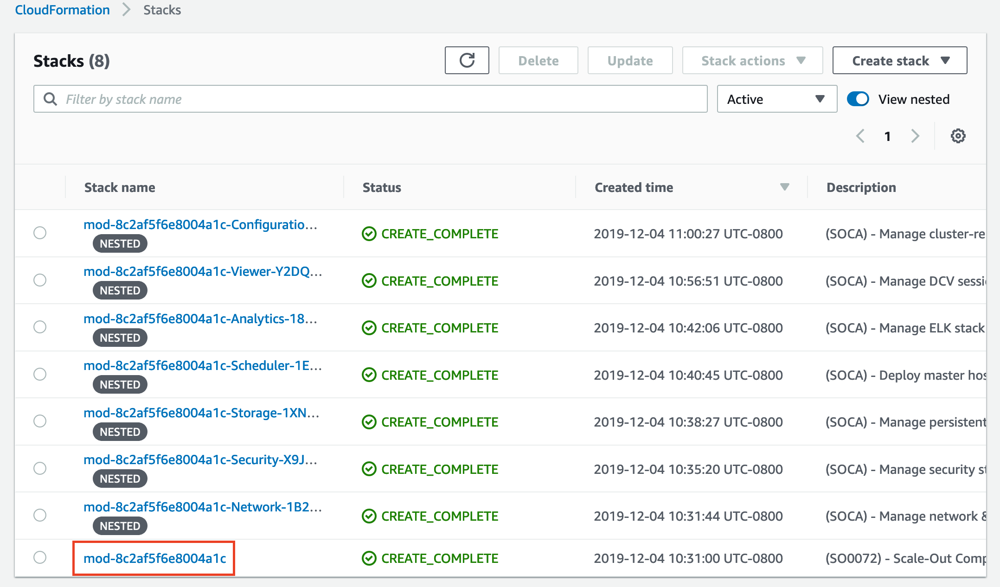
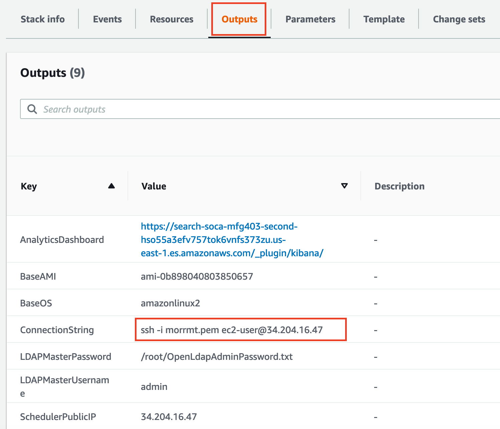

# Lab 2: Configure Remote Desktop

Once the solution has been deployed, we will configure the environment to use a specific Amazon Machine Image (AMI) for booting the remote desktop server.  As you saw in the [architecture diagram](../../), the DCV remote desktop will be your portal into the computing environment.  This AMI provides the CentOS 7.5 Linux operating system and the applications you'll use later in the workshop.

1. Obtain IP address of scheduler server
    1. In the AWS console, navigate to the CloudFormation page.

    1. Select the root stack named "soca-xxxxxxxxxxxx", where 'x' is a randomized alpha-numeric string, and click **Outputs**.

        

    1. The **Outputs** tab provides various bits of information about the provisioned environment. Copy the value to the left of **ConnectionString**.  We'll use this command to SSH into the scheduler instance.  

        

1. Connect to the instance over SSH

    1. For macOS, paste the SSH command into a terminal on the Mac.  Be sure to use the full path to the private key you downloaded earlier. See the steps here in the AWS [Connecting to Your Linux Instance using SSH](https://docs.aws.amazon.com/AWSEC2/latest/UserGuide/AccessingInstancesLinux.html) page if you need assistance.
    1. For Windows, follow the instructions in the AWS [Connect to your instance using PuTTY](https://docs.aws.amazon.com/AWSEC2/latest/UserGuide/putty.html) docs.

1. Once logged in, type `sudo su` to become root on the scheduler instance, then open the file `/apps/soca/$SOCA_CONFIGURATION/cluster_manager/settings/queue_mapping.yml` using your favorite text editor.
    
    Example: `vi /apps/soca/$SOCA_CONFIGURATION/cluster_manager/settings/queue_mapping.yml`

1. Change the the highlighted values in the file to match the example below.

    !!! note
        Indentation matters in this file.  Therefore, we advise against copying and pasting this entire block into the file, as this can result in malformed formatting.  Instead, please edit the value of each highlighted line individually.

    ```yaml hl_lines="4 7 8"
    queue_type:
    compute:
        queues: ["high", "normal", "low"]
        instance_ami: "ami-03f32123533983fdb"
        instance_type: "c5.large"
        ht_support: "false"
        root_size: "100"
        base_os: "centos7"
        #scratch_size: "100"
        #scratch_iops: "3600"
        #efa_support: "false"
        # .. Refer to the doc for more supported parameters
    ```

1. Save the changes to the file. The steps above configured the AMI ID to be used when we submit jobs to the compute queues specified above.


Keep this SSH session open; you will come back to it later.  Click the **Next** to move on to the next module.
