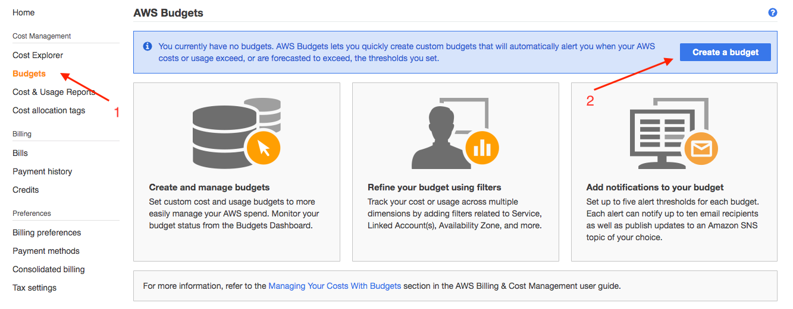

# Lab 6: Configure Budgets

This environment supports [**AWS Budgets**](https://aws.amazon.com/aws-cost-management/aws-budgets/) and lets you create custom budgets assigned to users, teams, projects, or queues. To prevent over-spending, you can integrate the scheduler with **AWS Budgets** to take action when customer-defined budget thesholds have been reached.  

In this example, we will reject job submissions from users who are not assigned to a project that is associated with an **AWS Budget**.

## Step 1. Create an AWS Budget

1. Go to the [AWS Billing Dashboard](https://console.aws.amazon.com/billing/home?region=us-west-2), and click **Budgets** on the left sidebar.
    
1. Click **Create budget**.
1. Select **Cost budget** and click **Set your budget**.
1. Name your budget "Project 1" and set **Budgeted amount** to **$100**.  Leave all other fields at their default values.
1. Click **Configure alerts**.
1. Set **Alert threshold** to 80 and add an email address to **Email contacts**.
1. Click **Confirm budget** to review the configuration, then click **Create**.

## Step 2. Enable budget enforcement

Next, you will enable the workload scheduler to be aware of the new budget you just created so that it will reject jobs from users who are not members of a project and associated budget.

To enable this feature, you will first need to verify the project assigned to each job during submission time.

1. Find the account ID for your temporary AWS account.

    1. Click [here](https://console.aws.amazon.com/billing/home?#/account) to go to the Account page of the AWS console.
    1. Copy the twelve digit **Account Id** number located underneath the Account Settings section.

1. Log back into the scheduler instance via SSH and edit the `/apps/soca/$SOCA_CONFIGURATION/cluster_hooks/queuejob/check_project_budget.py` script and paste the AWS account ID as the value for the `aws_account_id` variable. Save the file when done.

    ```bash hl_lines="2"
    # User Variables
    aws_account_id = '<ENTER_YOUR_AWS_ACCOUNT_ID>'
    budget_config_file = '/apps/soca/%SOCA_CONFIGURATION/cluster_manager/settings/project_cost_manager.txt'
    ```

1. Enable the integration with the scheduler by running the following commands on the scheduler host:

    ```bash
    sudo -i
    source /etc/environment
    qmgr -c "create hook check_project_budget event=queuejob"
    qmgr -c "import hook check_project_budget application/x-python default /apps/soca/$SOCA_CONFIGURATION/cluster_hooks/queuejob/check_project_budget.py"
    ```

## Step 3. Test budget enforcement

### Submit a job without budget assignment

1. Switch to the LDAP admin cluster user created in Lab 2. For example, if the username is `admin`, then the command would be: 

    `sudo su - admin`

1. Submit a job.

    `qsub -- /bin/echo Hello`

    This job will be rejected and you will see the following messages:

    ```text
    qsub: Error. You tried to submit job without project. Specify project using -P parameter
    ```

1. OK, let's add a project tag to comply with the policy.

    `qsub -P "Project 1" -- /bin/echo Hello`

    This job will also be rejected:

    ```text
    qsub: User admin is not assigned to any project. See /apps/soca/$SOCA_CONFIGURATION/cluster_manager/settings/project_cost_manager.txt
    ```

    Next, we'll associate the user with "Project 1" by adding the username to the `project_cost_manager.txt` mapping file.

1. As sudo, open the `/apps/soca/$SOCA_CONFIGURATION/cluster_manager/settings/project_cost_manager.txt` file and add "Project 1" budget and the "admin" user.

    ```hl_lines="17 18 20 21"
    # This file is used to prevent job submission when budget allocated to a project exceed your threshold
    # This file is not used by default and must be configured manually using /apps/soca/$SOCA_CONFIGURATION/cluster_hooks/queuejob/check_project_budget.py
    # Help & Documentation: https://soca.dev/tutorials/set-up-budget-project/
    #
    #
    # Syntax:
    #   [project 1]
    #   user1
    #   user2
    #   [project 2]
    #   user1
    #   user3
    #   [project blabla]
    #   user4
    #   user5

    [Project 1]
    admin
    ```

    !!!danger "Important"
        The config section ("Project 1") must match the name of the budget your created in AWS Budgets (it's case sensitive)

1. Save this file and try to submit a job. This time the job will be accepted.

The script queries the AWS Budget in real-time. So, if your users are blocked because of a budget restriction, you can at any time edit the value on AWS Budget and unblock them.

If a user tries to launch a job associated to a project which does not exist on AWS Budget or with an invalid name, you will see the following error:

```bash
qsub -P "Project 2" -- /bin/echo Hello
qsub: Error. Unable to query AWS Budget API. ERROR: An error occurred (NotFoundException) when calling the DescribeBudget operation: [Exception=NotFoundException] Failed to call DescribeBudget for [AccountId: <REDACTED_ACCOUNT_ID>] - Failed to call GetBudget for [AccountId: <REDACTED_ACCOUNT_ID>] - Unable to get budget: Project 2 - the budget doesn't exist.
```

Done!  On to the next lab.  Click **Next**.
